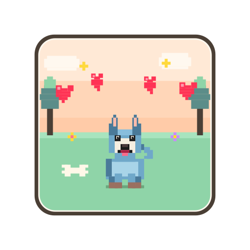

<p align="center">
  
</p>

# 🐾 Husky Hearts 🐾

A cozy 2D pixel-art game where you play as one of three real dogs, explore themed biomes, collect treats, cheer up lonely animal friends, dig up buried treasure, and grow your dog through a skill tree of active abilities. Built entirely with vanilla HTML, CSS, JavaScript and the Canvas API — no frameworks, no build dependencies beyond Python 3.

## Features

- 🐕 **Three playable dogs, each unique** — **Dinno** the alpha husky (tanky, fast), **Lolla** the clever sheltie (loud, great at haggling), and **Ťapka** the tiny Prague Ratter (frail but swift and near-silent, drawn with a smaller model). Each has its own real coat colours, stats, and a distinct pair of active abilities.
- 📊 **Stat bars that actually matter** — clicking a dog on the select screen shows 1–5 bars for **Health, Speed, Swimming, Noise, and Smarts**, and every one is real: *Noise* scales how far enemies detect you (and howling makes you louder), *Smarts* discounts shop prices and boosts quest rewards. The numbers are derived from the bars, so display and gameplay can never drift.
- 💥 **Floating combat numbers** — every hit pops a number where it landed: **gold** for damage your dog deals, **red** for damage it takes, green for healing, and mint **+XP** as orbs are picked up. A level-up blooms golden rings around the dog with a ⭐ LEVEL banner.
- 🌳 **Upgrade trees a click away** — 🌳 Skills and 🎓 Mastery buttons sit in the corner of the game frame and **glow with a count badge** whenever points are waiting to be spent. Step through a cleared level's portal and the skill tree opens itself on the journey map, so fresh points never sit forgotten — both trees are reachable there from 🌳 Skills / 🎓 Mastery.
- 🌳 **Two upgrade trees** — a shared **Skill tree** of character stats (Vitality, Swift Paws, Keen Nose, Soft Steps), with points earned by **clearing levels**, and a per-dog **Mastery tree** that ranks abilities up (to level 3), with points earned by **leveling up**. Open Skills with **K**, the 🌳 button, or from the inventory; respec freely to experiment.
- ⚡ **Active abilities with cooldowns** — each dog carries two abilities on **Q / E** plus a reserved **Ultimate** slot on **R**:
  - **Dinno** — *Storm Fang* (transform into a storm-wolf: rain, screen-darkening, lightning bolts that strike enemies, a fear aura, and a speed boost) and *Spirit of the Storm* (summon a spectral wolf that hunts on its own).
  - **Lolla** — *Ball Cannon* (place an auto-turret, load it with 🎾 balls from your hotbar, it fires at enemies and drops recyclable ammo) and *Piercing Scream* (a mobile AOE of damage + knockback, with a chance to frighten enemies at higher levels).
  - **Ťapka** — *Inner Monster* (go feral with red glowing eyes: melee bites that heal her — lifesteal for the frailest dog) and *Scurry* (an evasive dash with brief invulnerability).
  - Ability slots show a live cooldown sweep on the hotbar; using one early tells you how long is left.
- 💰 **Buried treasure chests** — chests are hidden underground; your dog **sniffs them out** (scent wisps that pulse faster as you close in — smarter dogs smell farther) and **digs them up** (Ťapka the ratter digs fastest). Rarities run 🟫 Wooden → ⬜ Iron → 🩶 Silver (**locked — needs a 🗝️ Key**) → 🟨 Golden, each with its own loot table of treats, consumables, wearables and chest-exclusive items (Golden Bone, Feast, and the 👑 Crown from golden chests).
- 🌀 **Exit portals** — clearing a level's quest opens a **biome-themed portal** you walk into to continue (instead of the map auto-opening). Finishing a biome's last level also drops a **golden chest** beside the portal.
- 🗺️ **Campaign world map & revisiting** — a "Your Journey" map shows your progress across the biomes (cleared ✓ / visited 👣 / current / locked). Tap a region to see its levels, then a level for its **detail card** — chests looted, which NPCs live there and whether they have a task, enemies left, friends cheered, treats still lying around — and **🐾 Travel here** to walk back in. A revisited level comes back **exactly as you left it**, so you can return to a shopkeeper or a quest-giver later. The world is designed as **environments of 3 levels + a boss** each.
- 🌱 **Seeded worlds** — every run has a seed, and every level's layout is built from it. Type your own on the character-select screen (`husky`, `12345`, anything) or leave it blank for a surprise, and the seed is shown on the pause menu and the map — click to copy and replay or share the same world.
- 💾 **Six save slots + autosave** — save into any of 6 slots from the pause menu, each card showing the dog, its level, where you are, the run's seed and when you saved. A separate autosave updates every time you arrive in a level. Saves are tiny because worlds regenerate from the seed.
- 🏞️ **Four playable levels so far** — the **Sunny Meadows** learning biome (*Sunny Meadow* → *Wildflower Field*, an enemy-free field introducing friendly wildlife → *Old Orchard Path*, which eases in a slow enemy and a river crossing), then the tougher **Rocky Mountains**: a Canadian-Rockies valley with snow-veined peaks, turquoise glacial lakes, waterfalls, evergreen forest, a river, and a prowling wolf pack. More biomes (Whispering Woods, Seashell Cove, Golden Dunes, Frostfang Tundra, Cloud Kingdom…) are stubbed on the map as *coming soon*.
- ⚔️ **Enemies that fight back — and can be defeated** — the grumpy badger and mountain wolves chase, lunge and bite; abilities damage and knock them back, and defeated enemies poof (with a chance to drop a treat). A howl briefly makes you louder, pulling enemies from farther — and a startled enemy pops a **"!"** when it first hears you.
- 🫎 **Friendly wildlife** — peaceful moose, beavers, loons, ducks and squirrels roam the world; greet them (action key) for a cheerful hello, sparkles, and a treat gift the first time. They never attack. Land animals (and enemies) **swim** when they enter water.
- 📜 **NPC quests & shops** — quest-givers show a glowing **"!"**; press the action key to hear the task, accept it, and hand in the goal for a reward. Tailor NPCs also sell wearables and 🗝️ chest keys for treats (smart dogs pay less).
- 🎒 **Inventory & wearables** — a drag-and-drop bag with a paper-doll: equip hats, shades, scarves, coats and capes onto your dog, drop items on the ground, and use consumables/toys from a 6-slot hotbar (number keys). Wearables fit each breed and layer correctly (capes drape over the dog's back when it faces away).
- 💡 **First-time feature tips** — the first time you meet a mechanic (collecting treats, cheering a friend, digging a chest, a shop, a quest, an enemy, an ability, wearing gear, leveling up, the journey map…) a little popup explains it, then never shows again. Each notes it can be turned off, and **Options** has a toggle plus "show all tips again."
- ⚙️ **Options screen** — fully **rebindable controls** (two keys per action), **music/effects volume sliders and mutes** (also always-visible quick-mute buttons in the HUD), and a **feature-tips** toggle. Opened from the start or pause menu.
- ✨ **XP orbs that stay put** — defeated enemies burst experience orbs that pop out, settle where they dropped and hover there until you come close enough to hoover them up.
- 🪦 **Fainting & graves** — a dog whose hearts run out faints (a grave marks the spot, a sad sound plays) — then it's **Game Over**, with **Play Again** (restart the level) and **Main Menu**.
- 🎵 **Synthesized music & SFX** — several selectable ambient soundtracks plus procedural sound effects (collecting, delivering, howling, digging, thunder, scream, roar…), all generated in-browser via the Web Audio API — no audio files.
- 📱 **Touch controls** — an on-screen D-pad and action button auto-appear on mobile.
- 🖥️ **Fullscreen mode** that scales the whole UI to fill any screen (with an iOS Safari pseudo-fullscreen fallback).

## Play

### Option 1: Open the standalone build directly
```
dist/husky-hearts.html
```
Open it in any modern browser. That's it — no server needed.

### Option 2: Serve the modular source
```bash
python3 -m http.server 8000
# then visit http://localhost:8000
```
This loads `index.html`, which references `dist/bundle.js`. You'll still need to run the build at least once.

### Building

```bash
python3 build.py
```

The build concatenates the modules in `src/` into:
- `dist/bundle.js` — single JS file (used by `index.html`)
- `dist/husky-hearts.html` — fully self-contained single-file build

Why bundle? Each `<script>` tag is its own top-level scope, so module-scoped `let`/`const` variables aren't visible to other tags. Concatenating into one script puts everything in the same scope so cross-module references just work.

## Controls

All keys are rebindable in **Options** (two bindings per action). Defaults:

| Action            | Keys                          |
|-------------------|-------------------------------|
| Move              | `W` `A` `S` `D`  or  Arrow keys |
| Howl / Deliver / Interact | `Space` or `Enter`    |
| Ability 1 (Q)     | `Q`                           |
| Ability 2 (E)     | `E`                           |
| Ultimate          | `R`                           |
| Inventory         | `I`                           |
| Quest Journal     | `J`                           |
| Skill Tree        | `K`                           |
| Hotbar items      | `1`–`6`                       |
| Pause             | `Esc`                         |
| Dev mode          | `` ` `` (backtick) or `<`     |

On touch devices an on-screen D-pad and action button appear automatically.

## How to play

1. Click **Play** on the main menu.
2. Pick a dog — check its stat bars and abilities on the select screen.
3. Wander the world collecting bones, hearts, balls and flowers; deliver treats to sad animals (walk up and hold the action key) until they cheer up 💛.
4. Open the **Skill Tree** (`K`) to learn and level your dog's abilities, then use them with **Q / E** — place a turret, scream, transform, summon a spirit wolf, or go feral.
5. Keep an ear out for **buried treasure**: when scent wisps appear at your dog's nose you're near a chest — dig it up (action key on the spot) and open it. Silver chests need a 🗝️ Key.
6. Watch your hearts around enemies — a fainted dog is Game Over (Play Again or Main Menu).
7. Clear the level's quest to open the **exit portal**; step through to continue your journey across the biomes.

## Project layout

```
husky-hearts/
├── index.html          ← entrypoint (loads dist/bundle.js) + UI panel markup
├── build.py            ← bundler (LOAD_ORDER controls concat sequence)
├── css/
│   └── style.css       ← all styles (HUD, panels, skill tree, hotbar, fullscreen)
├── src/                ← editable JS modules
│   ├── config/              ← JSON content configs (edit these to retune the game)
│   │   ├── items.json       item / wearable definitions → ITEMS_DATA
│   │   ├── loot.json        chest tables, enemy drops, XP payouts → LOOT_DATA
│   │   └── levels.json      per-level content (friends/npcs/enemies/critters/chests/quest) → LEVELS_DATA
│   ├── init.js              canvas & ctx setup
│   ├── core/
│   │   ├── rng.js           seeded RNG (mulberry32) + generation window (beginGen/rnd)
│   │   ├── run.js           the run seed — every level's layout derives from it
│   │   ├── state.js         SCENES enum + Game/World facades + dt-scaling
│   │   └── input.js         key state, rebindable action bindings, hotkey hooks
│   ├── data/
│   │   ├── breeds.js        per-dog 1–5 stat bars → derived stats + abilities
│   │   ├── skills.js        skill-tree nodes + Skills.apply (character + ability upgrades)
│   │   ├── items.js         item lookup + tooltip helpers (data from config/items.json)
│   │   ├── loot.js          rollLoot() — shared drop-table roller (independent chances)
│   │   ├── chests.js        chest rarities/roll (data from config/loot.json)
│   │   └── campaign.js      world-map environments (3 levels + boss each) + Progress
│   ├── inventory.js         positional bag: add/remove/stack/move
│   ├── wearables.js         equippable cosmetics: equip + per-breed on-dog rendering
│   ├── quests.js            NPC quest system (give-item + future types)
│   ├── health.js            hp/hearts, damage/heal, fainting, invulnerability
│   ├── audio.js             Web Audio engine, music buses, SFX
│   ├── world.js             world size, colliders, world objects, makePlayer
│   ├── levels/
│   │   ├── index.js         Levels registry + TERRAIN / AUGMENTS / QUEST_TYPES hooks
│   │   ├── from-config.js   builds every level from config/levels.json (generic generate())
│   │   ├── meadow.js        meadow terrain builder → TERRAIN.meadow
│   │   ├── meadow2.js       'wildflowers' augment (extra flower scatter)
│   │   ├── meadow3.js       'orchard' augment (extra oak clusters)
│   │   └── rocky.js         rocky terrain builder (peaks/lakes/waterfalls) → TERRAIN.rocky
│   ├── level-state.js       per-level dynamic state so visited levels stay as you left them
│   ├── level-manager.js     LevelManager.load/enter — build world + themed ground
│   ├── draw-helpers.js      px(), shade(), roundRect()
│   ├── world-draw.js        tree/rock/pond/mountain renderers + drawWorld (theme-aware)
│   ├── collectibles.js      drawCollectible (glow badge + plain ground items)
│   ├── friends.js           drawFriend (rescue animals)
│   ├── entities/
│   │   ├── registry.js      Entities registry + interaction + hurt/remove + noise/fear helpers
│   │   ├── enemy.js         grumpy badger (wander/chase, has hp, can be feared)
│   │   ├── wolf.js          mountain wolf (faster/tougher pack hunter)
│   │   ├── grave.js         grave marker left where a dog faints
│   │   ├── critter.js       friendly wildlife (moose/beaver/loon/duck/squirrel)
│   │   ├── npc.js           NPC kind (interactable → dialog/shop)
│   │   ├── chest.js         buried treasure chests (sniff → dig → unlock → loot)
│   │   ├── portal.js        biome-themed exit portal (spawned on level completion)
│   │   └── spiritwolf.js    Dinno's spectral storm-wolf companion
│   ├── abilities/
│   │   ├── registry.js      Abilities registry (dispatch + shared cooldowns)
│   │   ├── ballCannon.js    Lolla Q — placeable auto-turret
│   │   ├── scream.js        Lolla E — piercing AOE scream
│   │   ├── stormFang.js     Dinno Q — storm transformation + lightning
│   │   ├── spiritWolf.js    Dinno E — spectral wolf summon
│   │   ├── innerMonster.js  Ťapka Q — feral melee transform + lifesteal
│   │   └── scurry.js        Ťapka E — evasive dash + i-frames
│   ├── dog-sprite.js        drawDog dispatcher + per-breed renderers (incl. transform forms)
│   ├── sparkles.js          particle effects
│   ├── floaters.js          floating damage/XP numbers + level-up burst
│   ├── minimap.js           top-right corner minimap (theme-aware)
│   ├── update.js            updatePlayer, tryCollect/Deliver/Interact, checkWin
│   ├── toast.js             on-screen message popups
│   ├── tips.js              first-time feature tips (Tips.show, hooked across modules)
│   ├── save.js              save slots (1–6 + autosave) in localStorage (seed + level state)
│   ├── ui.js                HUD + panels (inventory / journal / skill tree / dialog / pause) + hotbar
│   ├── save-ui.js           save-slot picker overlay (save / load / delete)
│   ├── options.js           options screen: key rebinding + sound volume/mute
│   ├── world-map.js         between-levels campaign map (progress, level detail, travel)
│   ├── main.js              main rAF loop (scene-gated) + startup LevelManager.load
│   ├── fullscreen.js        canvas sizing + fullscreen (native + iOS fallback) + UI scaling
│   ├── mobile-controls.js   touch d-pad binding
│   ├── start.js             default resetGame() (overridden by charselect)
│   ├── charselect.js        character selection + stat bars + launchGame
│   └── dev.js               dev-mode panel — jump to any level/biome for testing
└── dist/               ← build outputs
    ├── bundle.js
    └── husky-hearts.html
```

## Architecture & extending

State is grouped into a few namespaces rather than loose globals: `Game` (scene + run
state), `World`, `Input`, `RNG`. Flow is a scene machine (`SCENES.MENU`, `CHARSELECT`,
`PLAYING`, `PAUSED`, `DIALOG`, `INVENTORY`, `WORLDMAP`, `WIN`, `GAMEOVER`) that the main
loop dispatches on — the world only updates while `PLAYING`, and freezes (but keeps
drawing) behind any open UI panel. Content is data-driven via registries, so the common
extensions are additive:

- **New dog / stats / abilities** → add an entry to `src/data/breeds.js` (1–5 `bars` +
  an `abilities:[Q, E, ultimate]` triple; real numbers derive from the bars).
- **New active ability** → implement `{spawn, reset, update, drawWorld?, drawOnDog?, speedMul?}`
  in `src/abilities/`, register it with a `skillNode`, point a breed's ability slot at it,
  and add a matching node in `src/data/skills.js`. Cooldowns and hotbar gating come for free.
- **New skill node** → add it to `src/data/skills.js` (`common` for all dogs, or `byBreed`);
  apply its effect in `Skills.apply(p)`.
- **Retune content / loot / shops / rewards** → edit the JSON in `src/config/` — no code:
  - `levels.json` — a level's friends, npcs (+ `wares` shop lists and `quest` + `reward`),
    enemies (`speed`/`chaseR`/`hp`), critters, buried `chests`, and quest label. Positions
    are `{x,y}` absolute, `{fx,fy}` fractional, or `{onWater:{kind,index,dx,dy}}`.
  - `loot.json` — chest tables, per-enemy drops, and XP payouts. Drops use **independent
    chances**: `{item,chance?}` (omit `chance` = guaranteed) or `{oneOf:[…],chance?}`, plus a
    guaranteed `treats:[min,max]` spill.
  - `items.json` — item/wearable definitions (`heal`, `slot`, `mods`, `abilityMods`, `value`).
  Run `python3 build.py` and reload; the build validates the JSON and bakes it into the bundle.
- **New level** → add an entry to `config/levels.json`. Reuse an existing `terrain` (`meadow`/
  `rocky`), or add a builder function in `src/levels/` that assigns `TERRAIN.<name> = fn`
  (optionally an `AUGMENTS.<name>` decorator). Terrain code must draw randomness from
  `rand()`/`rnd()`, never `Math.random()` — a level's terrain is rebuilt from the run seed
  every time you revisit it (`level-state.js` restores only the dynamic half on top).
- **New quest type** → add `QUEST_TYPES['<type>'] = { describe(), isComplete() }` (see
  `levels/from-config.js`) and reference it from a level's `quest.type`.
- **New enemy / NPC / world actor** → register a kind in `src/entities/` (with
  `update`/`draw`/`onInteract`, and `hp` if it should be damageable); then place instances via
  the level's `enemies`/`critters`/`npcs` list in `config/levels.json`.
- **New item** → add it to `config/items.json` (behaviour like `heal`/`mods` is read
  generically); use the `Inventory` API to grant it.

Remember to add any new **JS** file to `LOAD_ORDER` in `build.py` (dependency order); new
`config/*.json` files go in `CONFIG_FILES` there.

## Tech notes

- **No external dependencies.** No npm, no bundler, no audio assets — just the browser.
- **Content is data-driven.** Levels, loot tables, shop wares, quest rewards and item stats
  live in `src/config/*.json`. `build.py` validates each file and bakes it into the bundle as
  a global, so retuning the game is a JSON edit + rebuild — and the offline single-file build
  needs no runtime fetch.
- **All audio is synthesized.** Oscillator-driven soundtracks route through separate music
  and SFX buses (so volume/mute can be controlled independently); SFX are short oscillator envelopes.
- **All graphics are drawn at runtime** as pixel-art via 2D canvas calls. The ground is
  pre-rendered once to an offscreen canvas per level; everything else is redrawn per frame.
- **Frame-rate independent** movement via a per-frame `dtScale`, and canvases render at
  device resolution for crispness on high-DPI screens.
- **Painter's algorithm** sorts dogs + world actors by Y for depth.
- **Colliders** are axis-aligned bounding boxes tuned to each sprite's visible footprint.

## License

MIT — see [LICENSE](LICENSE)
